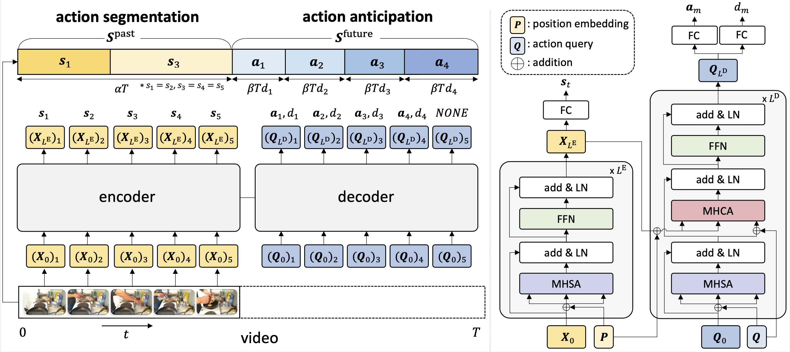

# Future Transformer for Long-term Action Anticipation (CVPR 2022)
### [Project Page](http://cvlab.postech.ac.kr/research/FUTR/) | [Paper](https://arxiv.org/abs/2205.14022)
This repository contains the official source code and data for our paper:

> [Future Transformer for Long-term Action Anticipation](https://arxiv.org/abs/2205.14022)  
> [Dayoung Gong](https://gongda0e.github.io/),
> [Joonseok Lee](https://scholar.google.com/citations?user=ZXcSl7cAAAAJ&hl=ko),
> [Manjin Kim](https://kimmanjin.github.io/),
> [Seong Jong Ha](https://scholar.google.co.kr/citations?user=hhQc51AAAAAJ&hl=ko), and
> [Minsu Cho](http://cvlab.postech.ac.kr/~mcho/)
> POSTECH & NCSOFT
> CVPR, New Orleans, 2022.

<div style="text-align:center">

</div>

## Citation
If you find our code or paper useful, please consider citing our paper:
```BibTeX
@inproceedings{gong2022future,
  title={Future Transformer for Long-term Action Anticipation},
  author={Gong, Dayoung and Lee, Joonseok and Kim, Manjin and Ha, Seong Jong and Cho, Minsu},
  booktitle={Proceedings of the IEEE/CVF Conference on Computer Vision and Pattern Recognition},
  pages={3052--3061},
  year={2022}
}
```

## Experiments
We conduct experiments on Breakfast with 4 splits and 50Salads with 5 splits.

|Dataset| Model |obs 0.2, pred 0.1|obs 0.2, pred 0.2|obs 0.2, pred 0.3|obs 0.2, pred 0.4|obs 0.3, pred 0.1|obs 0.3, pred 0.2|obs 0.3, pred 0.3|obs 0.3, pred 0.4| Checkpoint (Splits) |
|-------|-------|-----------------|-----------------|-----------------|-----------------|-----------------|-----------------|-----------------|-----------------|-----------------|
|Breakfast|FUTR|27.71|24.56|22.84|22.05|32.27|29.89|27.49|25.88| [1](https://postechackr-my.sharepoint.com/:u:/g/personal/gongda0e_postech_ac_kr/EUzTN0ybDthAua4v7VDR_8YBPr77nRqodpN0_8p2OuugNg?e=OKs8uY) [2](https://postechackr-my.sharepoint.com/:u:/g/personal/gongda0e_postech_ac_kr/EdfDn5KOEUVMqeOWd7_96JEBxMT8ALMxWtTRZcTMdlAVTA?e=gCiraz) [3](https://postechackr-my.sharepoint.com/:u:/g/personal/gongda0e_postech_ac_kr/ETSklysI9F5Ju9W2se6RwzkBlJfW89-MMtkv955geb48ng?e=MvAVZy) [4](https://postechackr-my.sharepoint.com/:u:/g/personal/gongda0e_postech_ac_kr/EfYdskp5XFROr6IL0LywKiAB2eT1CHq7mh5oEsjSN9ACPQ?e=9ESCPj)|
|50Salads|FUTR|37.01|27.81|22.46|16.75|33.32|23.17|22.14|15.49| [1](https://postechackr-my.sharepoint.com/:u:/g/personal/gongda0e_postech_ac_kr/EQJoAF7MSZxGltJ82ylbxoQBtBDMwxMxSn7bfi0z0rv1Bg?e=ogkqhe) [2](https://postechackr-my.sharepoint.com/:u:/g/personal/gongda0e_postech_ac_kr/EQ1rfz2VcAlOg6gxBn87eAkBhfptxrplZWW3_fkWfO3ftg?e=HZ6b71) [3](https://postechackr-my.sharepoint.com/:u:/g/personal/gongda0e_postech_ac_kr/EdgtGzn8jxhEpWsPE_KjQSEBfwq6EH1Sb4yZZU6KPUpFcg?e=6Hlucm) [4](https://postechackr-my.sharepoint.com/:u:/g/personal/gongda0e_postech_ac_kr/EV_3uQ-GCh1KnRXJhX4zWacBdIOouDW4soJDLzKFFjaYgA?e=zMl2Ss) [5](https://postechackr-my.sharepoint.com/:u:/g/personal/gongda0e_postech_ac_kr/EUfzEKbXHHtBuVceoCau6i4BGY1HhqADbXClSd5ne8YxmA?e=IdmzhR)|


## Environmental setup
* Conda environment settings:
```bash
conda env export > futr.yaml
conda activate futr
```

## Dataset
Download the data from https://mega.nz/file/O6wXlSTS#wcEoDT4Ctq5HRq_hV-aWeVF1_JB3cacQBQqOLjCIbc8 .   
Create a directory './datasets' for the two datasets and place each dataset to have following directory structure:
```bash
    ../                         # parent directory
    ├── ./                      # current (project) directory
    │   ├── data/               # (dir.) dataloaders for action anticipation dataset
    │   ├── model/              # (dir.) implementation of Hypercorrelation Squeeze Network model 
    │   ├── README.md           # intstruction for reproduction
    │   ├── train.py            # code for training FUTR
    │   ├── predict.py          # code for testing FUTR
    │   ├── otps.py             # code for arguments
    │   └── utils.py            # code for helper functions
    └── datasets/
        ├── breakfast/          # Breakfast dataset
        │   ├── groundTruth/
        │   ├── features/
        │   ├── mapping.txt
        │   └── ...
        ├── 50salads/          # 50salads dataset
        │   ├── groundTruth/
        │   ├── features/
        │   ├── mapping.txt
        │   └── ...
```

## Training
> ### 1. Breakfast
> ```bash
>./scripts/train.sh $split_num
>```

> ### 2. 50salads
> ```bash
>./scripts/50s_train.sh $split_num
>```

## Testing
> ### 1. Breakfast
> ```bash
>./scripts/predict.sh $split_num
>```

> ### 2. 50salads
> ```bash
>./scripts/50s_predict.sh $split_num
>```


## Acknowledgement
We thank [Yazan Abu Farha](https://scholar.google.com/citations?user=fSdpG-0AAAAJ&hl=en) for providing the code of [Long-term anticipation of activities with cycle consistency](https://arxiv.org/abs/2009.01142) and for helping us to reproduce experiments.
